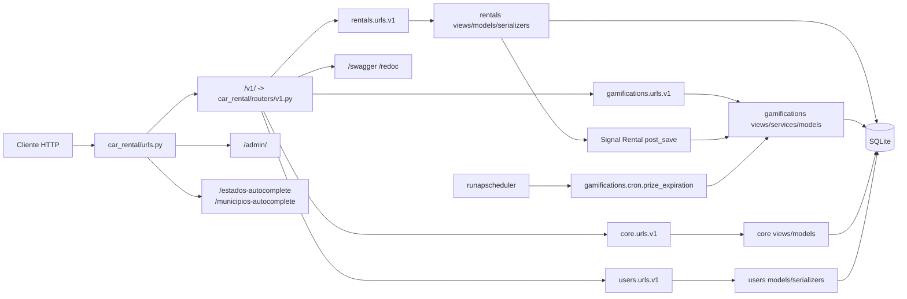
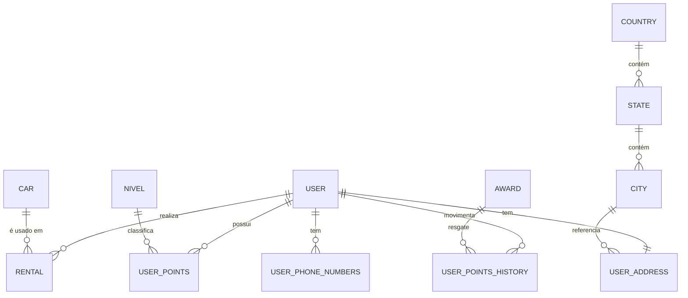
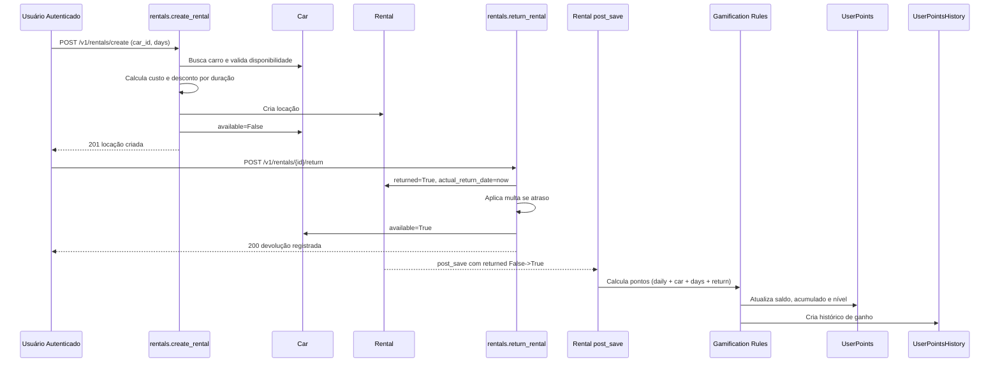

# Documentação Oficial - Backend Car Rental

## 1. Objetivo
API backend para gestão de locação de carros, usuários e gamificação de uso da plataforma.

Escopo principal:
- Cadastro e consulta de carros.
- Criação e devolução de locações.
- Pontuação automática por comportamento de locação.
- Resgate de prêmios por pontos.
- Administração via Django Admin.

## 2. Stack Técnica
- Python 3.11
- Django 4.2.7
- Django REST Framework 3.14
- SQLite (ambiente local)
- drf-yasg (Swagger e Redoc)
- django-filter
- django-autocomplete-light
- APScheduler + django-apscheduler

## 3. Arquitetura de Pastas e Organização

```text
backend/
├─ car_rental/                 # Configuração central Django (settings, urls, wsgi, asgi)
│  └─ routers/v1.py            # Roteador principal da API v1
├─ core/                       # Camada base e dados geográficos
│  ├─ models.py                # BaseModel, Country, State, City
│  ├─ views.py                 # Endpoints de State e City
│  ├─ views_autocomplete.py    # Endpoints de autocomplete (DAL)
│  ├─ scheduler/scheduler.py   # Definição dos jobs APScheduler
│  └─ management/commands/runapscheduler.py
├─ users/                      # Domínio de usuários
│  ├─ models.py                # User customizado + endereço + telefones
│  └─ serializers.py
├─ rentals/                    # Domínio de locação
│  ├─ models.py                # Car e Rental + signals de pontuação
│  ├─ views.py                 # Endpoints de locação
│  ├─ serializers.py
│  ├─ database.py              # Camada de acesso a dados legada/auxiliar
│  └─ urls/v1.py
├─ gamifications/              # Domínio de gamificação
│  ├─ models.py                # Regras de pontos, níveis, prêmios e histórico
│  ├─ views.py                 # Endpoints de pontos/histórico/resgate
│  ├─ services/redeem_award.py # Serviço transacional de resgate
│  ├─ cron.py                  # Rotina de expiração de prêmios
│  └─ urls/v1.py
├─ fixtures/                   # Carga de dados iniciais
├─ manage.py
├─ setup.cmd                   # Setup local no Windows
├─ requirements.txt
└─ docker-compose.yml
```

## 4. Visão Arquitetural



## 5. Configuração de Ambiente

### 5.1 Pré-requisitos
- Python 3.11+ instalado.
- `pip` disponível.

### 5.2 Setup Local com `setup.cmd`
Comando:
```bash
setup.cmd
```

O script realiza:
1. Criação do `venv` (se não existir).
2. Ativação do ambiente virtual.
3. Upgrade de `pip`.
4. Instalação de dependências (`requirements.txt`).
5. `makemigrations` e `migrate`.
6. Carga de dados de carros (`fixtures/init_data.py`).
7. Carga de país/estado/cidade (`fixtures/core/init_data.py`).
8. Criação de superusuário.

Depois do setup:
- API: `python manage.py runserver`
- Scheduler: `python manage.py runapscheduler`

### 5.3 Variáveis de Ambiente
Arquivo `.env` esperado:
- `SECRET_KEY`
- `DEBUG`
- `DJANGO_SETTINGS_MODULE`
- `TIME_ZONE` (opcional, default UTC)

## 6. Testes e Como Executar

### 6.1 Testes com Django Test Runner
```bash
python manage.py test rentals
python manage.py test core
python manage.py test gamifications
python manage.py test users
python manage.py test
```

### 6.2 Testes com Pytest
```bash
pytest
```

### 6.3 Observações de Cobertura
- O projeto possui arquivos de teste por app, porém a cobertura não é homogênea em todos os fluxos críticos.
- Recomenda-se ampliar testes para:
  - Regras de desconto e multa em `rentals`.
  - Cálculo de pontos e transições de nível em `gamifications`.
  - Fluxos de erro e autenticação dos endpoints.

## 7. Modelo de Dados (Visão Simplificada)



## 8. Fluxo de Negócio: Aluguel + Pontos de Gamificação



## 9. Endpoints de Todas as APIs

Base URL local:
- `http://localhost:8000`

Versão principal:
- `http://localhost:8000/v1/`

### 9.1 Sistema e Documentação
- `GET /v1/swagger/`
- `GET /v1/redoc/`
- `GET /v1/swagger.json` ou `/v1/swagger.yaml`
- `GET /admin/`

### 9.2 Auth Django (incluído em raiz)
Incluído via `django.contrib.auth.urls`:
- `/login/`
- `/logout/`
- `/password_change/`
- `/password_reset/`
- e variações do fluxo padrão de autenticação do Django.

### 9.3 Core API (`/v1/core/`)
- `GET /v1/core/states/` - lista estados.
- `GET /v1/core/states/{id}/` - detalhe estado.
- `GET /v1/core/cities/` - lista cidades.
- `GET /v1/core/cities/{id}/` - detalhe cidade.
- Filtros em cidades:
  - `?state={id}`
  - `?search={texto}`

Autocomplete:
- `GET /estados-autocomplete/?q={texto}`
- `GET /municipios-autocomplete/?state={id}&q={texto}`

### 9.4 Rentals API (`/v1/rentals/`)
- `GET /v1/rentals/` - index/boas-vindas da app.
- `GET /v1/rentals/cars` - carros disponíveis.
- `GET /v1/rentals/cars/{car_id}` - detalhe do carro.
- `GET /v1/rentals/list` - lista locações.
- `POST /v1/rentals/create` - cria locação.
- `POST /v1/rentals/{rental_id}/return` - devolução.
- `GET /v1/rentals/customer/{customer_email}` - locações por email.
- `GET /v1/rentals/stats` - estatísticas de locação.

Payload principal de criação:
```json
{
  "car_id": 1,
  "days": 5
}
```

### 9.5 Gamifications API (`/v1/gamifications/`)
- `GET /v1/gamifications/user-points/{user_id}/`
- `GET /v1/gamifications/user-points/history/`
- `GET /v1/gamifications/user-points/{user_id}/history`
- `POST /v1/gamifications/awards/{award_id}/redeem/`

### 9.6 Users API (`/v1/users/`)
- Atualmente sem endpoints de negócio publicados (router vazio).
- O domínio de usuário existe principalmente via modelo customizado e Admin.

## 10. Decisões de Arquitetura e Justificativas

### 10.1 Django Monolítico por Apps de Domínio
Decisão:
- Organizar funcionalidades por apps (`rentals`, `gamifications`, `users`, `core`) no mesmo projeto Django.

Justificativa:
- Simplifica deploy e manutenção para escopo atual.
- Facilita reutilização de ORM, autenticação e Admin.

Trade-off:
- Acoplamento maior do que microserviços, mas menor custo operacional.

### 10.2 API Versionada em `/v1/`
Decisão:
- Centralizar rotas versionadas no router `car_rental/routers/v1.py`.

Justificativa:
- Permite evolução de contrato sem quebra imediata de clientes.

Trade-off:
- Exige disciplina de manutenção entre versões futuras.

### 10.3 Gamificação por Signal de Domínio
Decisão:
- Pontuação é disparada automaticamente quando `Rental.returned` muda de `False` para `True`.

Justificativa:
- Garante que a regra de pontuação acompanhe o evento de negócio da devolução.

Trade-off:
- Fluxo implícito (via signal) pode dificultar rastreabilidade sem observabilidade adequada.

### 10.4 Scheduler em Processo Separado
Decisão:
- Usar comando dedicado `runapscheduler` para jobs periódicos.

Justificativa:
- Mantém o ciclo de API desacoplado dos jobs de manutenção.

Trade-off:
- Exige operação de mais de um processo em produção.

## 11. Execução Operacional

### 11.1 Rodar API
```bash
python manage.py runserver
```

### 11.2 Rodar Scheduler
```bash
python manage.py runapscheduler
```

### 11.3 Documentação Interativa
- `http://localhost:8000/v1/swagger/`
- `http://localhost:8000/v1/redoc/`

## 12. Riscos Técnicos Conhecidos
- `rentals/database.py` possui funções legadas com campos que não refletem totalmente o modelo atual.
- `docker-compose.yml` possui mapeamento de volume `./wheeler_test:/app`, que deve ser validado para este repositório.
- Parte das permissões está concentrada na lógica de view (não padronizada em toda API).
